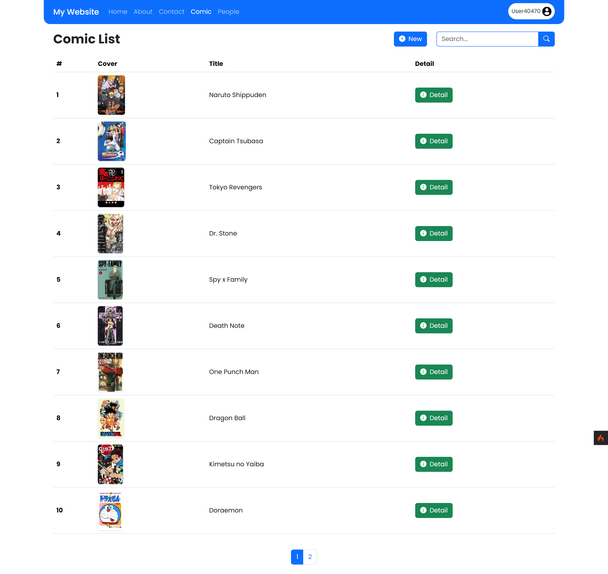

# Comic Website

Selamat datang di proyek **Comic Website**! 🎉 Proyek ini dibangun menggunakan CodeIgniter 4, proyek ini merupakan tugas mata kuliah Web Framework dengan studi kasus **Data Komik**. Aplikasi ini memanfaatkan **Bootstrap 5** untuk styling, **Bootstrap Icons** untuk icon, dan **Myth-Auth** untuk fitur login dan register.

## 🖥️ Screenshot



## 🚀 Teknologi yang Digunakan

-  **CodeIgniter 4.4**: Framework PHP untuk membangun aplikasi web.
-  **Bootstrap 5**: Framework CSS untuk desain responsif dan komponen UI.
-  **Bootstrap Icons**: Kumpulan ikon dan alat grafis untuk desain web.

## 📦 Instalasi

1. **Clone Repository**:
    ```bash
    git clone https://github.com/alfian742/comic-website.git
    ```

2. **Masuk ke Direktori Proyek**:
    ```bash
    cd comic-website
    ```

3. **Update Dependensi**:
    ```bash
    composer update
    ```

4. **Konfigurasi ENV**:
    - Ubah nama `.env.example` menjadi `.env`.
    - Lakukan konfigurasi sesuai kebutuhan.

5. **Migrate Database dan Seeder**:
    ```bash
    php spark migrate
    ```

   ```bash
    php spark migrate -all 
    ```

   ```bash
    php spark db:seed KomikSeeder
    ```

   ```bash
    php spark db:seed OrangSeeder
    ```

7. **Jalankan Aplikasi**:
    ```bash
    php spark serve
    ```
    - Akses aplikasi di browser melalui URL: `http://localhost:8080`.

## 📖 Panduan Penggunaan

1. **Register**:
   - Buat akun baru dengan menggunakan fitur register.

2. **Login**:
   - Masukkan kredensial login setelah registrasi.

3. **CRUD Operasi**:
   - **Create**: Tambahkan data baru melalui form input.
   - **Read**: Lihat daftar data dengan fitur pencarian dan pagination.
   - **Update**: Edit data dengan memilih opsi edit pada tabel.
   - **Delete**: Hapus data dengan memilih opsi hapus pada tabel.

4. **Konfigurasi Login/Register (Opsional)**:
   - Konfigurasi dapat dilakukan pada direktori `vendor/myth/auth/src`.
    
